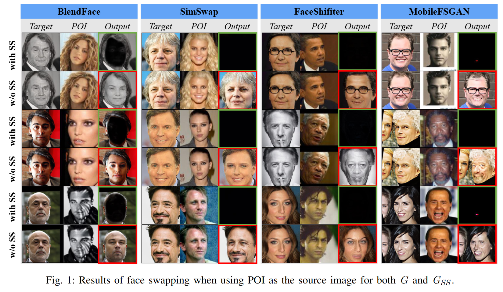
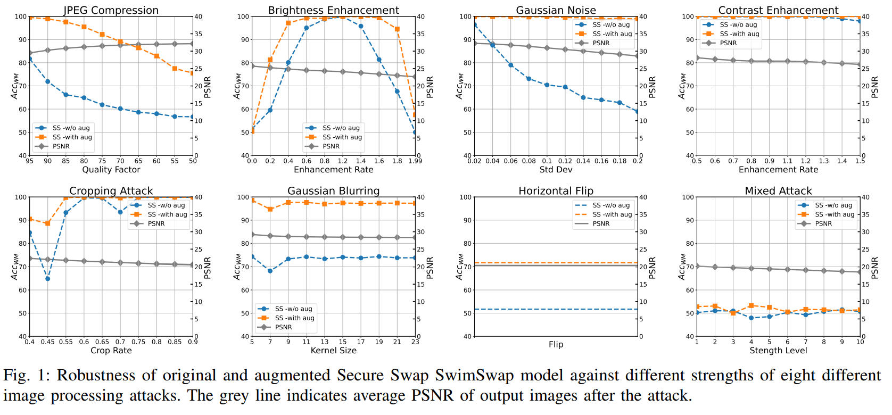
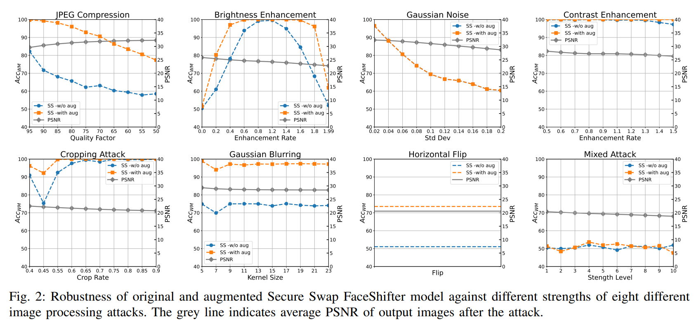
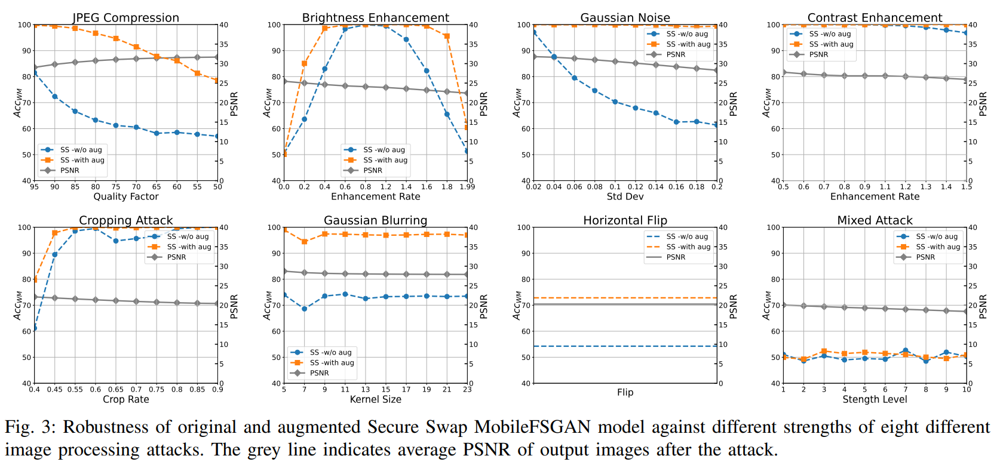

# This is the Supplementary materials of the paper "Secure Swap: Responsible Face Swap With Persons of Interest Redaction and Provenance Traceability"

This section provides visual results of face swapping when using POI as the source image for both $\mathit{G}$ and $\mathit{G_{SS}}$ across different models as referenced in Section Section IV (Experimental Results and Discussions) of Subsection D ( Effectiveness analysis) of the main manuscript. 
We compares the effectiveness of four face swap methods (BlendFace, SimSwap, FaceShifter and MobileFSGAN) under conditions without and with \textit{Secure Swap}. It shows that any attemt involving POI can only get a black image on $\mathit{G_{SS}}$, indicating that \textit{Secure Swap} is effective in POI redaction.

The following supplementary experimental figures present the robustness test results of the models against images and attacks, as discussed in Section 4 (Experimental Results and Discussions) of Chapter D (Robustness Experiments) in the paper. 

The main body shows the robustness results of SecureSwap based on BlendFace. 

Here, we supplement the robustness results for the models SimSwap, FaceShifter, and MobileFSGAN after applying Secure Swap.

   
